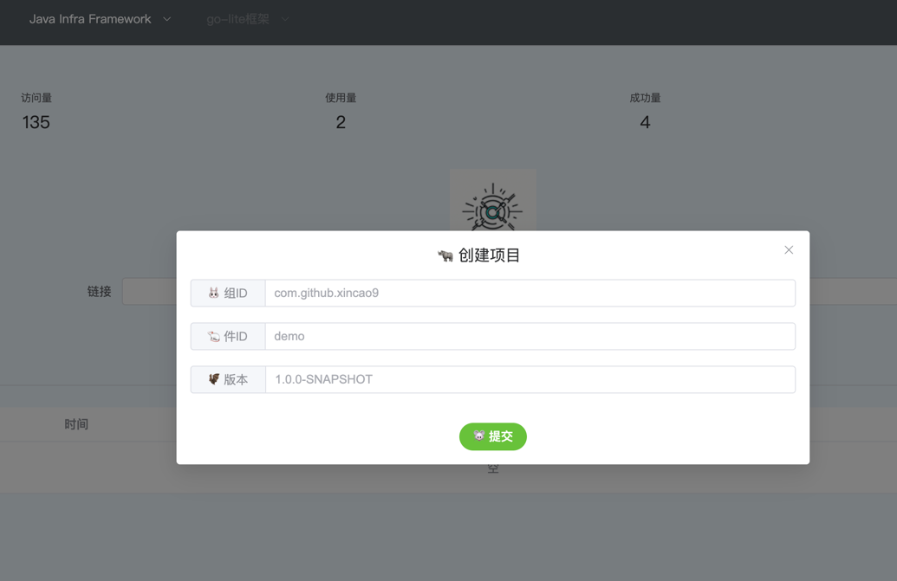

# infra-framework

提供开箱即用的Java基础框架；让你一分钟就可以用最佳实践去开发业务

## [infra-core](https://github.com/xincao9/infra-framework/tree/main/infra-core)

提供一些Java项目实践中常用的功能

## [grpc-pure-spring-boot-starter](https://github.com/xincao9/grpc-pure-spring-boot-starter)

一个简化 gRPC 集成到 Spring Boot 应用中的轻量级框架

## [infra-config](https://github.com/xincao9/infra-framework/tree/main/infra-config)

无需为了集中配置管理，而增加新的中间件；依赖git对配置进行权限和版本管理；极少的代码量方便进行二次开发

## [infra-trace](https://github.com/xincao9/infra-framework/tree/main/infra-trace)

拒绝臃肿的依赖，保持功能专一

## [infra-archetype](https://github.com/xincao9/infra-archetype)

**原型模板**：用于快速生成基础设施项目

## [Infra Starter](https://golinks.fun/)

